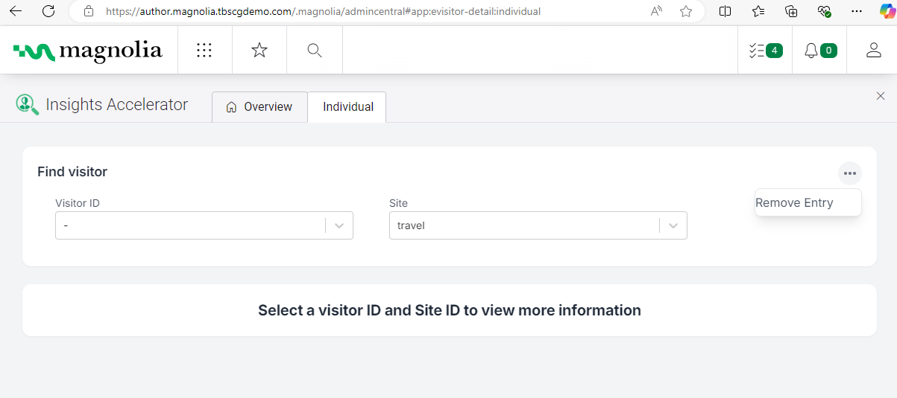

### Content Management User Guide

1. Magnolia Pages to be tracked

    a.Go to: Pages

    

    b. Check HomePage of the ‘to-be-tracked’ section

    c. Click ‘Edit Page Properties’

    d. Got to ‘Personalization’ tab 

    e. Make sure the ‘Use AI Auto Tagging’ checkbox is checked.

    

2. Reaching Insights Accelerator app
    a. Open Magnolia 

    b. Find the Insights Accelerator app:

        i. in the ‘Custom’ section
   
    

   or:
        ii. via the ‘Search’ functionality
   
   
   
   

3. Insights Accelerator General Overview:

   a. the Overview Tab:

   

   The ‘Overview’ tab presents:

    i. The number of Sites Being Tracked

    ii. Top interests, in form of:

        1. Pie chart for top 10, top 20 or all

        2. Table with:

            a. search 
            b. sort by weight parameter
            c. export into PDF and excel

    b. the 'Individual' tab

      
    

   The ‘Individual’ tab presents:

    i. Visitor Id dropbox

        1. Visitor Id dropbox shows all recorded unique visitors that entered the page. 
             These unique visitors are logged before the visitor accepts the Cookie Banner.
             No tracking is done without the cookie consent (those IDs do not show any data).

    

   No data is shown without the Cookie Consent:

    

   A Specific UserID **MUST** be chosen to see the data (if available)

   Search Functionality allows to look for specific User ID

    

        2. Site dropbox
            a. Site Dropbox shows sites the chosen UserID visited.
            A specific site MUST be chosen to see the data (if available).
            Search Functionality allows to look for specific Site 
        3. Remove Entry
            a. Remove Entry allows to remove a single VisitorID&Site pair from the data.

    c. Summary Section

        i. Generate Summary Button
        ii. All Interest/Summarize picker 

    d. Profile section

        i.profile chart
         created based on visited pages, indicating interest for those pages.
        ii.Profile amount picker

    
    

    e. Top Interests Table

    

        i.Search
            1. search functionality allows to search by any value in any column
            
        ii. Table
            contains columns:
                1. Interest,
                2. Decay
                3. Weight
        iii. Export
                1. export as PDF
                2. export as Excel
        iv. Pagination

    f. Top Interest Chart

    

        i. number off op Interest Selector
        ii. on/off interests from the chart:

     

    g. Recently Viewed section

    

     i.Search 
         By page or date

     ii. Table 
         1. Page
         2. Date

     iii. Export
         1. export as PDF
         2. export as Excel

     iv. Pagination